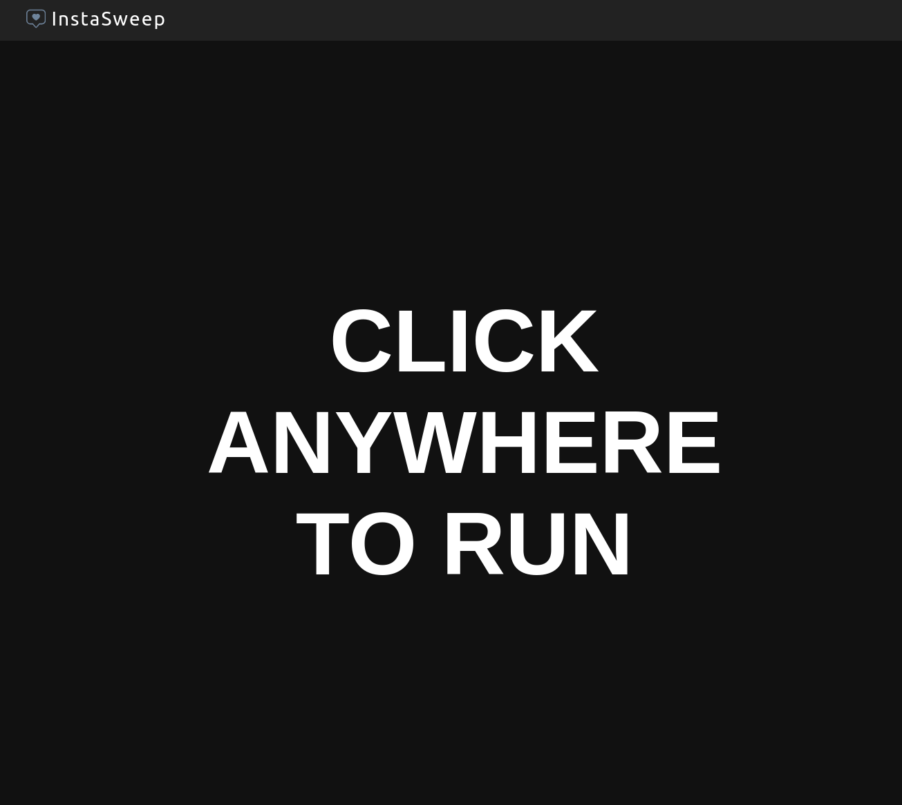

# InstaSweep

<svg viewBox="13 15 73 69" width="55px" style="fill: #6f849b">
    <path
        d="M71.79,15.18H28.21c-8.31,0-15.04,6.74-15.04,15.04v26.11c0,8.31,6.74,15.04,15.04,15.04h8.57l10.44,12.16   c0.73,0.85,1.75,1.28,2.78,1.28s2.05-0.43,2.78-1.28l10.44-12.16h8.57c8.31,0,15.04-6.74,15.04-15.04V30.23   C86.83,21.92,80.1,15.18,71.79,15.18z M82.83,56.34c0,6.09-4.95,11.04-11.04,11.04h-8.57h-1.84l-1.2,1.39L50,80.64L39.81,68.78   l-1.2-1.39h-1.84h-8.57c-6.09,0-11.04-4.95-11.04-11.04V30.23c0-6.09,4.95-11.04,11.04-11.04h43.57c6.09,0,11.04,4.95,11.04,11.04   V56.34z"
    />
    <path
        d="M56.45,31.26c-0.11,0-0.22-0.01-0.33-0.01c-2.94,0-4.76,1.53-5.41,2.19L50,34.17l-0.71-0.73   c-0.64-0.66-2.46-2.19-5.41-2.19c-0.11,0-0.22,0-0.33,0.01c-2.52,0.1-4.9,1.28-6.52,3.24c-2.72,3.28-2.6,7.2,0.34,11.65   c0.04,0.06,4.03,5.79,12.64,10.53c8.58-4.73,12.6-10.48,12.63-10.52c2.95-4.46,3.06-8.38,0.34-11.66   C61.35,32.54,58.97,31.36,56.45,31.26z"
    />
</svg>
  

A fully-fledged Instagram tool that allows you see who doesn't follow you back and take action!  
<u>Browser-based and requires no downloads or installations!</u>

## Features

-   **Generate a list of the Instagram users you follow**

-   **Filter to see specific group of users. Most notably, users who do not follow you back**

-   **Unfollow any of these users in bulk**

-   **Whitelist users of your choosing**

-   **Copy these users as a list to clipboard**

-   **Search for specific users**

-   **Use keyboard hot-keys for extra comfort**

## Usage

1.  Go to the following URL:

### https://SocialForge.github.io/InstaSweep/

2. Press the COPY button to copy the code.

 

3. Once you have copied the code, you can close this page and go to the instagram website.

4. Log into your account and open the developer console (F12) and paste the code.

5. You will be met with the following interface:

 

6. Click anywhere to start scanning for users who do not follow you back.

7. Once it finishes printing the users, you will be met with the following screen which will show you the results:

 

8. If you wish to unfollow any of these users, you can select 1 or more of them by clicking on them and then clicking the "UNFOLLOW" button on the bottom left

## HotKeys \*️⃣

Only relevant in "Scanning" screen.

-   **LEFT ARROW** - previous page
-   **RIGHT ARROW** - next page
-   **CTRL+A** - select all users in list
-   **CTRL+S** - open search bar
-   **CTRL+C** - copy selected user list to clipboard

## Dev 🔧

Contributions are welcome!

To get started, follow these steps:

1. Clone the GitHub repository to your local machine

2. Run `npm i` to install the required dependencies

3. Introduce your desired changes

4. Run `npm run build` to compile your changes and update the build files

5. Submit a PR for review

## Notes 📔

**_The more users you have to check, the more time it will take_**

**_The script has been tested only on Chromium-based browsers_**

**_The script is actively supported only on Chromium-based browsers_**

## Legal ⚖️

**Disclaimer:** This is not affiliated, associated, authorized, endorsed by, or in any way officially connected with Instagram.

Use it at your own risk!.
