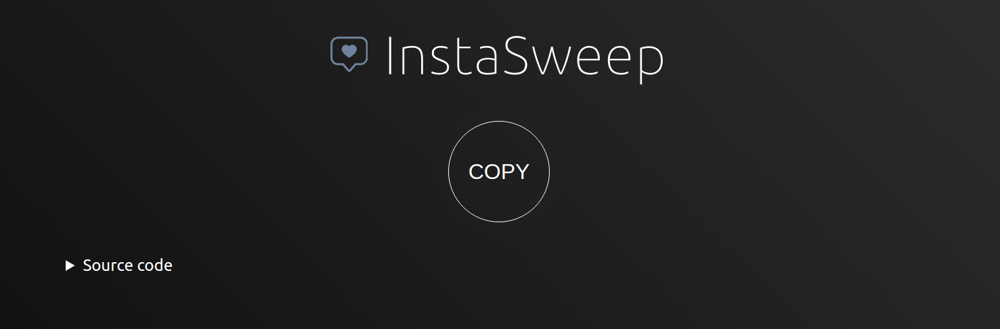
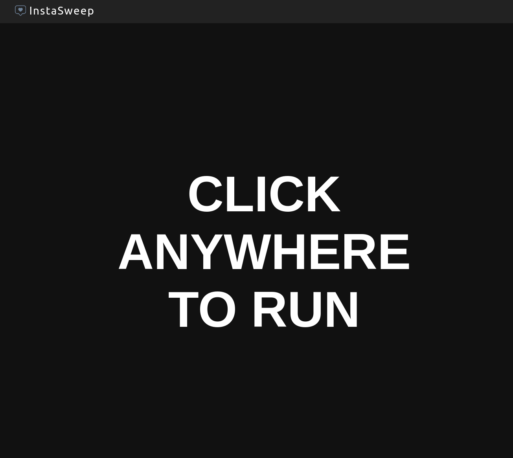
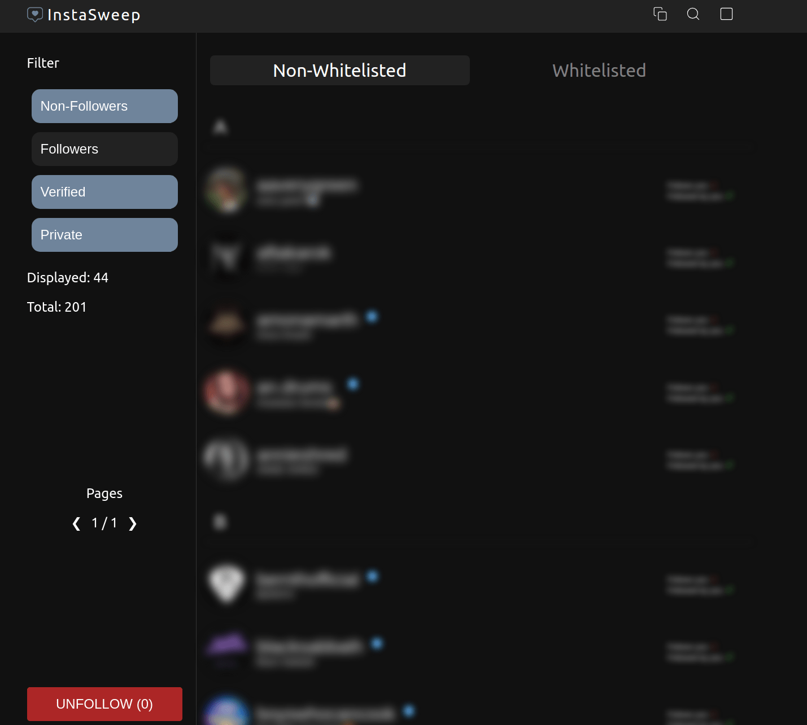

# InstaSweep

A fully-fledged Instagram tool that allows you see who doesn't follow you back and take action!  
<u>Browser-based and requires no downloads or installations!</u>

## Features

-   **Generate a list of the Instagram users you follow**

-   **Filter to see specific group of users. Most notably, users who do not follow you back**

-   **Unfollow any of these users in bulk**

-   **Whitelist users of your choosing**

-   **Copy these users as a list to clipboard**

-   **Search for specific users**

-   **Use keyboard hot-keys for extra comfort**

## Usage

### Method 1: Manual copy and paste

1.  Go to the following URL:

### https://SocialForge.github.io/InstaSweep/

2. Press the COPY button to copy the code.

 

3. Open [Instagram](instagram.com), log into your account and open the developer console (F12) and paste the code.

### Method 2: Chrome extension

1. Download the latest `InstaSweep.zip` file from the repository's [`Releases`](https://github.com/SocialForge/InstaSweep/releases) section.

2. Unzip the contents of the file.

3. Open a Chromium-based web browser (Chrome, Chromium, Brave, Edge, etc...)

4. Go to `Manage extension` menu within the web browser

5. Enable `Developer mode` in order to manually add an extension

6. Click `Load unpacked`. This will open the browser's file selection dialog

7. Navigate to the previously extracted `public` directory and open it

8. Once inside, press `Select folder` and the extension should be added to your browser extensions

9. Open [Instagram](instagram.com), log into your account and click on the extension, or hit **CTRL+I** on the keyboard to execute.

## Running the script

Upon running the script via any of the methods mentioned above, you will be met with the following interface:

 

Click anywhere to start the scanning process.

Once it finishes, you will be met with the following screen which will show you the results:

 

If you wish to unfollow any of these users, you can select 1 or more of them by clicking on them and then clicking the "UNFOLLOW" button on the bottom left.

## HotKeys \*️⃣

Only relevant in "Scanning" screen.

-   **LEFT ARROW** - previous page
-   **RIGHT ARROW** - next page
-   **TAB** - switch tab
-   **CTRL+A** - select all users in list
-   **CTRL+S** - open search bar
-   **CTRL+C** - copy selected user list to clipboard
-   **CTRL+X** - whitelist / unwhitelist selected users

## Dev 🔧

Contributions are welcome!

To get started, follow these steps:

1. Clone the GitHub repository to your local machine

2. Run `npm i` to install the required dependencies

3. Introduce your desired changes

4. Run `npm run build` to compile your changes and update the build files

5. Submit a PR for review

## Notes 📔

**_The more users you have to check, the more time it will take_**

**_The script has been tested only on Chromium-based browsers_**

**_The script is actively supported only on Chromium-based browsers_**

## Legal ⚖️

**Disclaimer:** This is not affiliated, associated, authorized, endorsed by, or in any way officially connected with Instagram.

Use it at your own risk!
